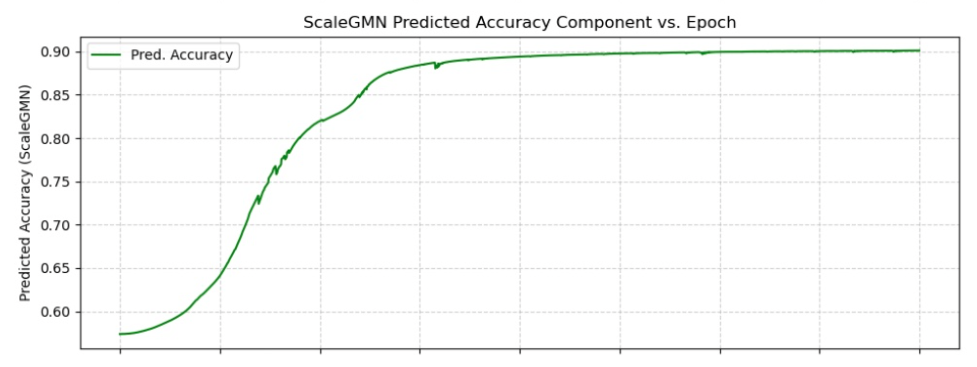

# <p align="center"> Neural Network Pruning with Scale Equivarient Graph Metanetworks (ScaleGMN)</p>


<p align="center">Freek Byrman, Tobias Groot, Bart Kuipers and Daniel Uyterlinde (May 2025)<p align="center">
 


<p align="center"> <p align="center">


# **Part 1: Project Description**

## **Section 1.1: Introduction**
Neural Networks (NNs) have seen a dramatic increase in scale, leading to a greater demand for efficient model optimization techniques such as architecture search, pruning, and knowledge transfer. Metanetworks, designed to analyze and process other NNs, offer a promising solution to this challenge. These models function as mappings, $\hat{f} :\mathcal{G} \times \boldsymbol{\Theta} \to \mathcal{Y}$
​where $\mathcal{G}$ represents the space of computational graphs (NN architectures) and Θ denotes the space of learnable parameters. Within this framework, metanetworks can act as either functionals, producing scalar or vector-valued outputs ($\mathcal{Y} \subset \mathbb{R}^d$), or operators, transforming the network's structure or parameters ($\mathcal{Y} = \mathcal{G} \times \boldsymbol{\Theta}$).

A critical aspect of processing NNs is acknowledging their inherent symmetries. Permutation symmetry, involving the reordering of nodes within a layer and corresponding connection adjustments, is a fundamental example. Beyond permutations, scaling symmetries, which arise from non-zero scalar multiplication or division of weights and biases, also exist but have been less extensively explored. These symmetries establish equivalence classes of parameter configurations that represent identical functions. Formally, an NN symmetry is defined by a set of transformations $\psi : \mathcal{G} \times \Theta \to \mathcal{G} \times \Theta$ such that the function $u_{G,\theta} : \mathcal{X} \to \hat{\mathcal{X}}$ remains unchanged, i.e., $u_{G,\theta}(x) = u_{\psi(G,\theta)}(x)$ for all inputs $x \in X$.

The recognition of these symmetries has driven the development of symmetry-invariant metanetworks. While traditional metanetworks may learn to account for NN symmetries through extensive training, invariant metanetworks are explicitly designed to respect these symmetries by construction. This design principle ensures consistency across functionally equivalent representations, streamlines model learning by obviating the need to rediscover known mathematical symmetries, and enhances generalization to novel NN configurations. Specifically, a metanetwork acting as a functional must be invariant to symmetry transformations: $\hat{f}(\psi(G,\theta)) = \hat{f}(G,\theta)$, while one acting as an operator should be equivariant: $\hat{f}(\psi(G,\theta)) = \psi(\hat{f}(G,\theta))$.

### **Related Work:** 
Recent advancements in metanetworks, particularly Graph Meta Networks (GMNs), have demonstrated improved performance in tasks like NN classification and weight generation by leveraging permutation symmetries, either through architectural design or GMNs. Building on this, Kalogeropoulos et al. introduced the Scale Equivariant Graph Meta Network (ScaleGMN) to incorporate scaling symmetries, extending the GMN framework with scale-equivariant message passing. This work applies the ScaleGMN framework to NN pruning, a critical optimization task that can be broadly categorized into unstructured (individual weight removal) and structured (neuron or channel removal) pruning. Structured pruning, in particular, presents significant automation challenges due to inter-layer dependencies and the exponential growth of possible channel configurations, making exhaustive search impractical. Consequently, traditional automated methods relying on non-differentiable reinforcement learning or evolutionary algorithms often require lengthy search times to converge. While meta-networks have emerged as an alternative pruning strategy, initially by generating weights for candidate pruned structures to enable immediate evaluation and later by directly pruning networks. Noteworthy is the differentiable meta-pruning method by Li et al., which uses hypernetworks that generate weights from latent vectors encoding layer configurations. Although these meta-pruning approaches consistently outperform traditional methods, their integration within the ScaleGMN framework has remained unexplored. Our research addresses this gap by proposing two pruning strategies utilizing ScaleGMN: one as a functional and another as an operator.

## **Section 1.2: Potential of ScaleGMN**
After some brainstorming, we expected ScaleGMN to hold significant potential for advancing neural network pruning, due to its knowledge of network topology and ability to predict accuracy from weights. By modeling both permutation and scaling symmetries, ScaleGMN can provide a more robust and accurate understanding of how parameter transformations affect network functionality. Our main idea was that this inherent symmetry-awareness can guide pruning algorithms to identify and remove redundant neurons or channels more effectively, ensuring that (in Invariant Pruning) the pruned network maintains its performance while achieving higher sparsity levels (Invariant Pruning), or that using ScaleGMN as an operator for allows for direct output of structured pruned parameters (Equivariant Pruning), bypassing the need for extensive pre-training datasets of pruned networks and enabling on-the-fly training applicable to diverse CNN architectures. This ability to directly transform and prune networks in a symmetry-preserving manner suggests a powerful new avenue for automating and optimizing the pruning process, potentially leading to smaller, more efficient models without sacrificing accuracy.

## **Section 1.3: Contributions**
Our work introduces two novel strategies for neural network pruning, leveraging the recently developed Scale Equivariant Graph Meta Network (ScaleGMN) framework. These methods, termed "Invariant Pruning" and "Equivariant Pruning," represent the first exploration of ScaleGMN's application in the domain of NN pruning.

Our contributions can be summarized as follows:

* Invariant Pruning method with ScaleGMN: We propose an "Invariant Pruning" method that utilizes ScaleGMN as a functional, predicting the generalization performance of a target network. This approach involves training a ScaleGMN to estimate accuracy from weights and then using this trained predictor to guide a pruning process that optimizes for sparsity while maintaining predicted accuracy. A key aspect is the augmentation of the Small CNN Zoo dataset with pruned networks to better match the ScaleGMN's training data with its pruning objective.

* Equivariant Pruning method with ScaleGMN: We introduce an "Equivariant Pruning" method where ScaleGMN acts as an operator, directly outputting a set of structured pruned parameters from the input network's architecture and parameters. This method is trained end-to-end to produce sparse weights while ensuring the pruned network maintains its classification performance. This approach bypasses the need for extensive pre-training datasets of pruned networks, offering broader applicability and on-the-fly training.

* Empirical Validation and Comparison: We provide comprehensive experimental results comparing our ScaleGMN-based pruning methods against established baselines such as L1 regularization, magnitude-based pruning, and Iterative Magnitude Pruning (IMP). Our findings demonstrate competitive performance, with ScaleGMN-Inv often outperforming baselines at higher sparsity levels for Small CNNs, and ScaleGMN-Eq showing competitive results for both Small CNNs and larger models like VGG19.

* Dataset of Pruned Models: As part of the Invariant Pruning method, we contributed a dataset of 4050 pruned networks at different sparsities. This augmentation aims to address potential out-of-distribution issues when a ScaleGMN trained on dense networks evaluates pruned ones.

## **Section 1.4: Results**
We present our results in the table below:

<p align="center">
  
</p>

### Invariant Pruning
We observe that Invariant Pruning with ScaleGMN encounters a critical limitation: the accuracy predicted by ScaleGMN during pruning is often highly unreliable; the predicted accuracy quickly grows to 90%, which to the best of our knowledge is impossible with <4970 parameters. 

<p align="center">
  
</p>

We hypothesize that the optimization process exploits the predictor, steering the model’s weights toward regions in the parameter space where the predicted accuracy is artificially inflated.This undermines the validity of the guidance signal, making the pruning process more challenging. To address this, we finetuned ScaleGMN on an augmented dataset containing pruned networks. While this slightly reduced the prediction gap, the issue of unreliable accuracy estimates during pruning remained largely unresolved. Interestingly, despite this shortcoming, the method still outperforms all baselines. Toward the end of the pruning process, the L1 term and the predicted accuracy begin to converge, suggesting that the accuracy predictor, though imperfect, still plays a valuable role in preserving critical weights during the final stages of pruning.

### Equivariant Pruning
Nog wachten op freek zn results


## **Section 1.5: Conclusion**
In this work, we introduced Invariant and Equivariant Pruning, two novel methodologies utilizing Scale Equivariant Graph Metanetworks (ScaleGMNs) that leverage permutation and scaling symmetries. Invariant Pruning, employing ScaleGMN as an accuracy predictor (functinonal), contributed a dataset of approximately 4000 pruned networks. This method showed competitive performance for Small CNNs, often outperforming baselines at higher sparsity levels, but faced limitations due to pre-training dataset requirements and prediction reliability on sparse architectures. Conversely, Equivariant Pruning, using ScaleGMN as an operator, bypassed extensive pre-training, allowing on-the-fly training and broader applicability to various CNNs. It demonstrated competitive results for both Small CNNs and larger models like VGG19. Our findings underscore the significant inductive bias provided by incorporating scaling symmetries in metanetwork design. Future work will focus on improving ScaleGMN's efficiency and prediction reliability, and extending its application to architectures with skip connections. 

## **Section 1.6: Main Contributions per Author**
* **Bart Kuipers:** Theoretical foundation, literature review and writing.
* **Daniel Uyterlinde:** Invariant Pruning approach, dataset of pruned networks and GitHub repository.
* **Freek Byrman:** Equivariant Pruning approach, theoretical foundation, literature review and writing.
* **Tobias Groot:** Benchmarking and literature review.
  
# **Part 2: Code**
## **Section 2.1: Reproduction original experiments**
*NOTE: This section is partially adapted from [Kalogeropoulos et al.](https://github.com/jkalogero/scalegmn).* 

### Setup

To create a clean virtual environment and install the necessary dependencies execute:
```bash
git clone git@github.com:daniuyter/scalegmn-pruning.git
cd ScaleGMN-pruning/
conda env create -n scalegmn --file environment.yml
conda activate scalegmn
```

### Data
First, create the `data/` directory in the root of the repository:
```bash
mkdir data
````
Alternatively, you can specify a different directory for the data by changing
the corresponding fields in the config file.

### INR Classification and Editing
For the INR dataset, we use the data provided by [DWS](https://github.com/AvivNavon/DWSNets) and [NFN](https://github.com/AllanYangZhou/nfn/).
The datasets can be downloaded from the following links: 

```bash
DATA_DIR=./data
wget "https://www.dropbox.com/sh/56pakaxe58z29mq/AABrctdu2U65jGYr2WQRzmMna/mnist-inrs.zip?dl=0" -O "$DATA_DIR/mnist-inrs.zip"
unzip -q "$DATA_DIR/mnist-inrs.zip" -d "$DATA_DIR"
rm "$DATA_DIR/mnist-inrs.zip" # remove the zip file
# generate the splits
python src/utils/generate_data_splits.py --data_path $DATA_DIR/mnist-inrs --save_path $DATA_DIR/mnist-inrs
```

#### Phase canonicalization
For the INR dataset, we preprocess each datapoint to canonicalize the phase symmetry (see [Algorithm 1](https://arxiv.org/pdf/2406.10685v1#algocf.1) in the appendix).
To run the phase canonicalization script, run the following command:

```bash
python src/phase_canonicalization/canonicalization.py --conf src/phase_canonicalization/mnist.yml
```

The above script will store the canonicalized dataset in a new directory `data/<dataset>_canon/`. The training scripts will automatically use the canonicalized dataset, if it exists.
To use the dataset specified in the config file (and not search for `data/<dataset>_canon/`), set the `data.switch_to_canon` field of the config to `False` or simply use the CLI argument `--data.switch_to_canon False`. 

### Generalization prediction
We follow the experiments from [NFN](https://github.com/AllanYangZhou/nfn/) and use the datasets provided by [Unterthiner et al,
2020](https://github.com/google-research/google-research/tree/master/dnn_predict_accuracy). The dataset can be downloaded from the following links:
- [CIFAR10](https://storage.cloud.google.com/gresearch/smallcnnzoo-dataset/cifar10.tar.xz)

Similarly, extract the dataset in the directory `data/` and execute:

For the CIFAR10 dataset:
```bash
tar -xvf cifar10.tar.xz
# download cifar10 splits
wget https://github.com/AllanYangZhou/nfn/raw/refs/heads/main/experiments/predict_gen_data_splits/cifar10_split.csv -O data/cifar10/cifar10_split.csv
```

### Experiments
For every experiment, we provide the corresponding configuration file in the `config/` directory.
Each config contains the selected hyperparameters for the experiment, as well as the paths to the dataset.
To enable wandb logging, use the CLI argument `--wandb True`. For more useful CLI arguments, check the [src/utils/setup_arg_parser.py](src/utils/setup_arg_parser.py) file.

**Note:** To employ a GMN accounting only for the permutation symmetries, simply set 
`--scalegmn_args.symmetry=permutation`.

### INR Editing
To train and evaluate ScaleGMN on the INR editing task, use the configs under
[configs/mnist_editing](configs/mnist_editing) directory and execute:

```bash
python inr_editing.py --conf configs/mnist_editing/scalegmn_bidir.yml
```

### Generalization prediction
To train and evaluate ScaleGMN on the INR classification task, 
select any config file under [configs/cifar10](configs/cifar10)
or [configs/svhn](configs/svhn). For example, to 
train ScaleGMN on the CIFAR10 dataset on heterogeneous activation functions,
execute the following:

```bash
python predicting_generalization.py --conf configs/cifar10/scalegmn_hetero.yml
```


# **Section 2: Pruning with ScaleGMN**

### Invariant Pruning
First, make sure to set your preferred pruning settings in the config file:

```bash
configs/cifar10/scalegmn_relu.yml
```
The values in this file are the original values we used for our experiments.

To run our Invariant Pruning method with a pretrained and finetuned ScaleGMN, the best way is to run the following file:
 
```bash
gradual_pruning.py --conf configs/cifar10/scalegmn_relu.yml
```

This will gradually prune (at sparsities 60-70-80-90%) and finetune the best CNN from SmallCNNZoo on the CIFAR10-GS split, which we discussed in the paper. The pruned models will be selected based on best validation accuracy, and will be saved to the directory from where you can load and evaluate them on CIFAR10-GS. 

To evaluate the pruned models, run the following command:

```bash
python evaluate_model.py --conf configs/cifar10/scalegmn_relu.yml --model_path <model path>
```

### Equivariant Pruning


# Citation

```bib
@article{kalogeropoulos2024scale,
    title={Scale Equivariant Graph Metanetworks},
    author={Kalogeropoulos, Ioannis and Bouritsas, Giorgos and Panagakis, Yannis},
    journal={Advances in Neural Information Processing Systems},
    year={2024}
}
```
